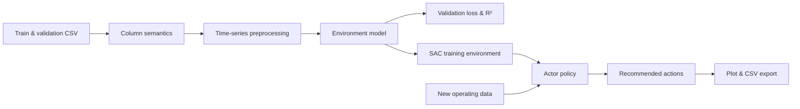

# UEO-AI: Universal Energy Operation Optimization

An end-to-end **industrial energy optimization framework** that learns equipment behavior from historical time-series data and converts the learned dynamics into actionable operating recommendations.

UEO-AI was designed as a reusable workflow for eight common energy-consuming systems—**air compressors, HVAC systems, cooling towers, motors, furnaces, boilers, pumps, and fans**—without hard-coding the pipeline to one machine or one CSV schema.

> Research question: Can one configurable AI pipeline learn different equipment dynamics and optimize control actions without requiring a separate application for every machine type?

## Problem

Industrial energy optimization is difficult to generalize:

- equipment has different sensors, control variables, and operating patterns;
- real-world time-series data contains missing values, outliers, and incompatible scales;
- testing control policies directly on physical equipment can be costly or unsafe; and
- a prediction model alone does not answer the operational question: **what action should the operator take next?**

UEO-AI addresses this by separating the problem into two learned components:

1. an **environment model** that approximates equipment response from historical state-action sequences;
2. a **Soft Actor-Critic (SAC) policy** that searches the learned environment for energy-efficient actions.

## System Architecture



The environment model predicts reward-related equipment signals from state and action sequences. SAC then uses those predictions to learn a policy that balances the configured reward terms, including power factor and power consumption signals when those columns are available.

## My Contribution

- Designed a **schema-configurable pipeline** in which users identify timestamp, action, and reward columns through the UI rather than modifying training code.
- Built reusable preprocessing for datetime handling, IQR outlier removal, missing-value imputation, feature scaling, and sliding-window sequence generation.
- Implemented three interchangeable PyTorch environment models: **LSTM, GRU, and Transformer**.
- Added experiment controls for loss functions, optimizers, schedulers, learning rate, epochs, pretrained checkpoints, and early stopping.
- Implemented an **LSTM-based Soft Actor-Critic agent** with twin critics, replay buffer, warm-up training, checkpointing, and deterministic inference.
- Added a **Golden Sample baseline** so learned policies can be compared with actions retrieved from historically similar operating states.
- Built the complete workflow as a modular **Gradio application**, including live training curves, model selection, inference visualization, and downloadable CSV recommendations.
- Refactored UI tabs, model logic, preprocessing, and training utilities into separate modules to make new equipment types and algorithms easier to add.

## Results

The current project delivers a working research prototype rather than a claimed production energy-saving percentage:

- one interface covers the full path from raw CSV data to recommended control actions;
- environment-model experiments report **training loss, validation loss, validation R², and learning-rate history**;
- SAC training reports **actor and critic loss** and saves the best model checkpoints;
- inference supports both the learned SAC Actor and the Golden Sample baseline;
- generated action trajectories are shown interactively and exported to timestamped CSV files.

Quantitative energy savings are intentionally not reported without equipment-specific field validation. The next experimental step is offline policy evaluation and controlled deployment against a defined operational baseline.

## What I Learned

- A reusable industrial AI system depends as much on **data contracts and preprocessing consistency** as on model architecture.
- Learning a surrogate environment allows control research without continuously experimenting on physical equipment, but policy quality is bounded by model fidelity and training-data coverage.
- Validation R² is useful but insufficient: a model can predict average behavior well and still be unreliable in the operating regions selected by an RL policy.
- Separating prediction from control makes the framework easier to evaluate—environment-model error and policy behavior can be diagnosed independently.
- An optimization recommendation should remain auditable, so model checkpoints, training curves, input-column definitions, and exported actions are first-class outputs.

## End-to-End Workflow

1. **Upload data** — provide separate training and validation CSV files.
2. **Define semantics** — select equipment type, timestamp, action, and reward columns.
3. **Clean and transform** — configure imputation, scaling, and sequence length.
4. **Train the environment** — choose LSTM, GRU, or Transformer and monitor validation performance.
5. **Train the solver** — use the selected environment checkpoint to train the SAC policy.
6. **Run inference** — generate actions with SAC or the Golden Sample baseline.
7. **Export recommendations** — inspect action trajectories and download them as CSV.

## Supported Components

| Layer | Implemented options |
|---|---|
| Equipment profiles | Air compressor, HVAC, cooling tower, motor, furnace, boiler, pump, fan |
| Missing-value handling | Mean, median, most-frequent value, or constant |
| Scaling | Min-max or standard scaling |
| Environment models | LSTM, GRU, Transformer |
| Training configuration | Selectable loss, optimizer, scheduler, learning rate, epochs, checkpoint |
| Policy optimization | Soft Actor-Critic with LSTM actor, twin critics, and replay buffer |
| Inference baselines | SAC Actor, Golden Sample |
| Outputs | Training plots, model checkpoints, action plots, downloadable CSV |

## Quick Start

```bash
git clone https://github.com/excellent77/UEO_AI.git
cd UEO_AI

python -m venv .venv
source .venv/bin/activate        # Windows: .venv\Scripts\activate
pip install -r requirements.txt
python main.py
```

Gradio prints the local application URL after startup. Open it in a browser and complete the tabs from left to right.

The project automatically creates:

```text
model_record/
├── LSTM_Model/                    # environment-model checkpoints
├── GRU_Model/
├── Transformer_Model/
└── RL_models/                     # SAC actor and critic checkpoints

output/                            # timestamped inference CSV files
```

CUDA-enabled PyTorch packages are pinned in `requirements.txt`; GPU acceleration is used when available, with CPU fallback handled by the application.

## Input Data

UEO-AI does not require fixed sensor names. Both training and validation files should be CSVs with compatible columns and chronological observations. Through the UI, assign:

- one timestamp column;
- one or more **action columns** representing controllable settings; and
- one or more **reward columns** representing equipment response or energy-performance signals.

For inference, the uploaded CSV must contain the state columns established during solver setup.

## Project Structure

```text
.
├── main.py                         # Gradio application entry point
├── ui_tabs/
│   ├── Preprocessing.py            # cleaning, scaling, and sequence generation
│   ├── models.py                   # environment models, SAC, training, inference
│   ├── tab_upload.py               # dataset upload and preview
│   ├── tab_select_cols.py          # equipment and column semantics
│   ├── tab_dataclean.py            # preprocessing configuration
│   ├── tab_hyperparam.py           # environment-model experiments
│   ├── tab_solver.py               # SAC policy training
│   ├── tab_inference.py            # action generation and export
│   └── tab_shared.py               # shared configuration and plotting
├── utils/
│   ├── losses.py                   # loss-function factory
│   ├── optimizers.py               # optimizer factory
│   └── schedulers.py               # scheduler factory
└── requirements.txt
```

## Current Limitations & Next Steps

- Add reproducible benchmark datasets and equipment-level energy-saving metrics.
- Evaluate policies offline against historical and rule-based baselines before field deployment.
- Add action bounds, operational safety constraints, and out-of-distribution detection.
- Persist preprocessing metadata with each checkpoint for fully independent inference sessions.
- Add automated tests for data transformations, checkpoint compatibility, and policy outputs.

## Tech Stack

**Python · PyTorch · Gradio · pandas · NumPy · scikit-learn · Matplotlib**
